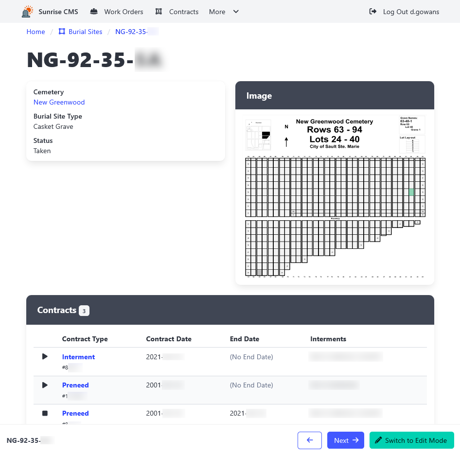

[Home](https://cityssm.github.io/sunrise-cms/)

# Sunrise CMS Help Documentation

**Thank you for taking the time to read the**
**Sunrise Cemetery Management System (CMS) documentation.**

## 👩 User Documentation

Documentation covering the day-to-day workings in Sunrise CMS.

[**Cemeteries**](./cemeteries.md)  
Create as many cemeteries as you like.

[**Burial Sites**](./burialSites.md)  
Manage the burial sites within each cemetery.

[**Contracts**](./contracts.md)  
Track preneed contracts and burial site interments.

[**Work Orders**](./workOrders.md)  
Assign work associated with burial sites and contracts.

[**Reports**](./reports.md)  
Export a variety of data in the flexible CSV format.

## 💼 Application Administrator Documentation

[**Fee Management**](./feeManagement.md)  
Administer fees that apply to contracts.

[**Contract Type Management**](./contractTypeManagement.md)  
Maintain the types of contracts available.

[**Burial Site Type Management**](./burialSiteTypeManagement.md)  
Maintain the types of burial sites.

[**Config Table Management**](./configTableManagement.md)  
Maintain simpler, list-like tables including work order types and burial site statuses.

[**User Management**](./userManagement.md)  
Grant permissions to Sunrise CMS users.

[**Settings**](./settings.md)  
Front-end management of application settings more common among power users.

[**Database Management**](./databaseManagement.md)  
Create database snapshots. Perform database cleanup operations.

## 🤓 Systems Administrator Documentation

[**Installation**](./installation.md)  
Spin up your own instance of Sunrise CMS.

[**Logging In for the First Time**](./firstLogIn.md)  
Set up user autentication and permissions.

[**config.js**](./configJs.md)  
Customize Sunrise CMS to meet your needs.

[**Regular Administrative Maintenance**](./regularAdminMaintenance.md)  
Tasks that should be regularly performed to keep Sunrise CMS running smoothly.
