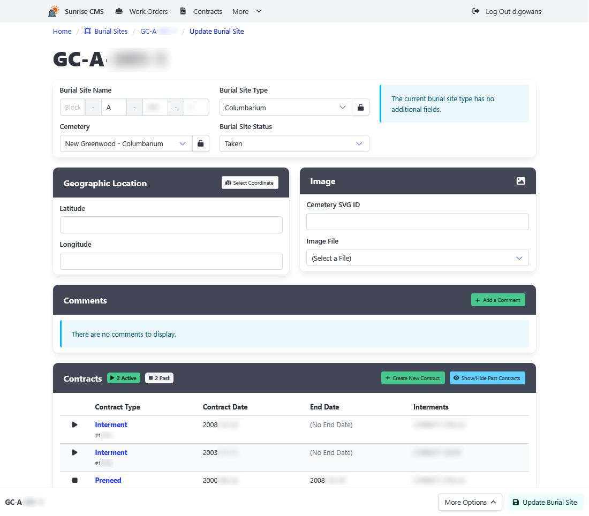

[Home](https://cityssm.github.io/sunrise-cms/)
•
[Help](https://cityssm.github.io/sunrise-cms/docs/)

# Burial Sites

Burial sites are the locations within [cemeteries](./cemeteries.md) where
interments take place.

## Key Burial Site Fields

**Burial Site Name** 
Can be up to five segments, each with their own requirements.
Can be prepended with the cemetery key.
Must be unique system wide.

**Geographic Location** 
Used to show the burial site location on a map.

**Cemetery SVG ID** 
Used to highlight the burial site within the cemetery's SVG image.
