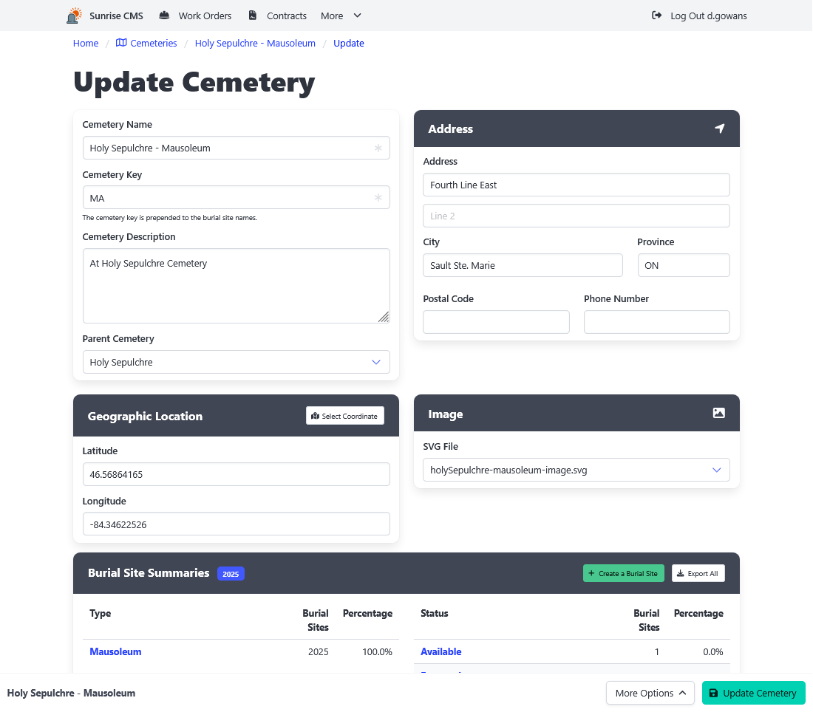

[Home](https://cityssm.github.io/sunrise-cms/)
•
[Help](https://cityssm.github.io/sunrise-cms/docs/)

# Cemeteries

Cemeteries are groupings of [burial sites](./burialSites.md).

## Key Cemetery Fields

**Cemetery Key** 
Can be prepended to burial site names.

**Parent Cemetery** 
Helpful when breaking larger cemeteries into smaller sections.

**Geographic Location** 
Used to show the cemetery location on a map.

**Image** 
An SVG image of the cemetery, optional labelled to allow for burial site highlighting.
