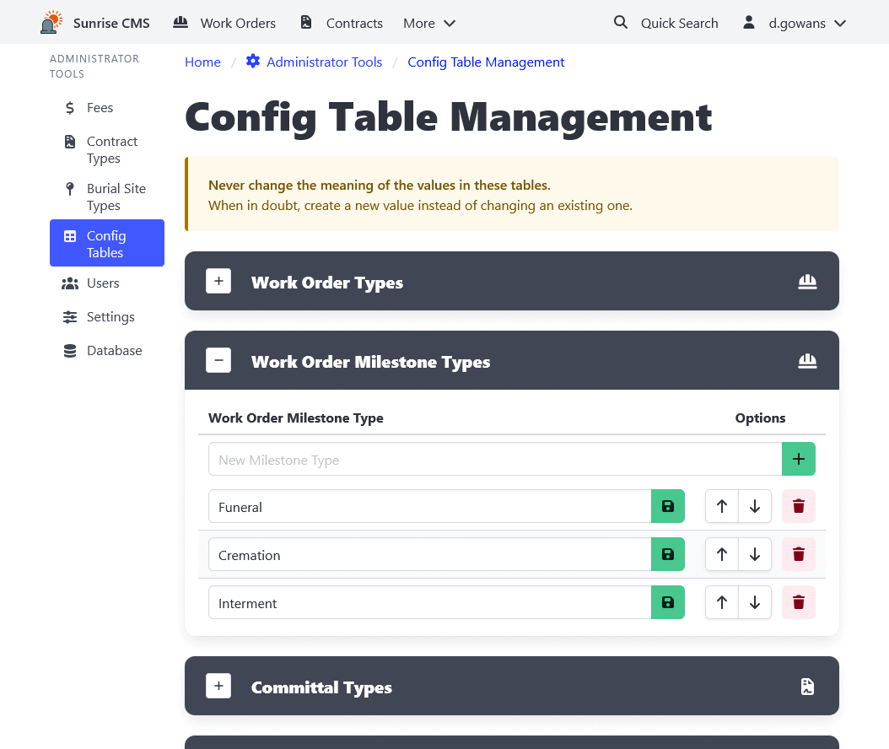

[Home](https://cityssm.github.io/sunrise-cms/)
•
[Help](https://cityssm.github.io/sunrise-cms/docs/)

# Config Table Management

The Config Table Management page includes update interfaces
for the simpler configuration tables. Tables available to update
from this page include:

- Work Order Types
- Work Order Milestone Types
- Committal Types
- Interment Container Types
- Burial Site Statuses

Note when updating values in configuration tables,
never change the meaning of the values. While it is okay to correct
spelling mistakes, changing the meaning of values will
cascade those changes to all records that use those values.
When in doubt, create a new value instead of changing an existing one.

## Related

- [Burial Site Type Management](./burialSiteTypeManagement.md)
- [Contract Type Management](./contractTypeManagement.md)
