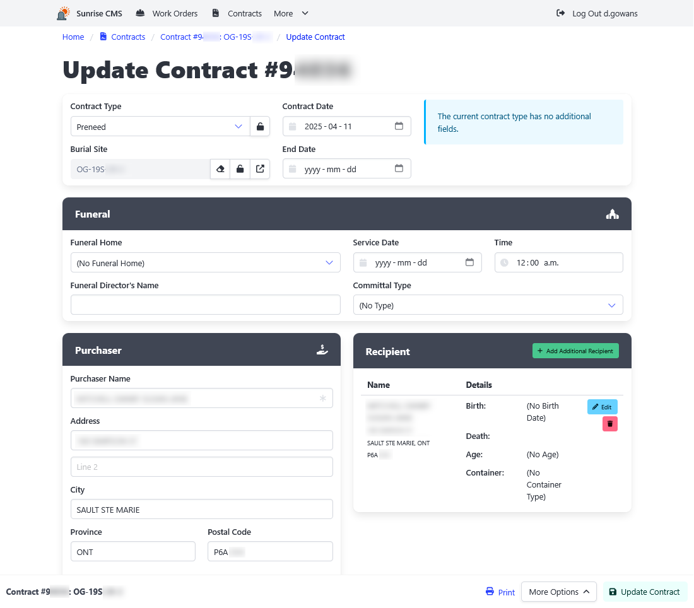

[Home](https://cityssm.github.io/sunrise-cms/)
•
[Help](https://cityssm.github.io/sunrise-cms/docs/)

# Contracts

Contracts track preneed [burial site](./burialSites.md) reservations,
and at-need burial site interments.

## Key Contract Fields

**End Date** 
When set, the end date is considered the date the contract no longer applies.
In the case of a preneed contract, an end date should be applied when
the recipient passes and is interred in the burial site.
In the case of an at-need contract, the end date should remain empty as long
as the deceased is interred in the burial site.

## Related

- [Contract Type Management](./contractTypeManagement.md)
