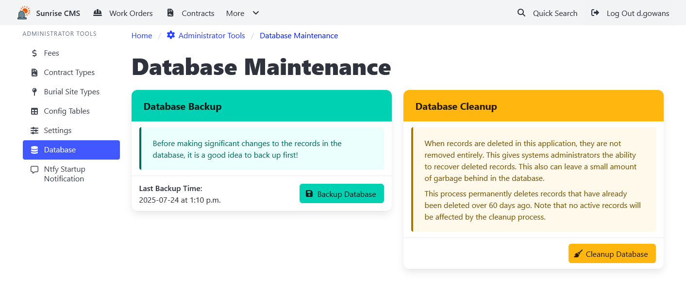

[Home](https://cityssm.github.io/sunrise-cms/)
•
[Help](https://cityssm.github.io/sunrise-cms/docs/)

# Database Management

The Database Management interface provides administrators with tools to maintain and manage the Sunrise CMS database.

## Database Backup

**It is recommended to backup the database before making significant changes.**

Database backups can be made on demand by clicking the "Backup Database" button.
It is also possible to make daily backups using properties in the [config.js file](./configJs.md).

## Database Cleanup

Cleanup removes old deleted records to free up database space and improve performance.
No active records are affected by the cleanup process.
