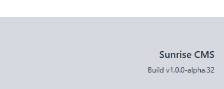

[Home](https://cityssm.github.io/sunrise-cms/)
•
[Help](https://cityssm.github.io/sunrise-cms/docs/)

# Regular Administrative Maintenance

Sunrise CMS is a self-hosted solution, which puts onus on the
application administrator to maintain the installation.
There are a few things the administrator should do regularly to maintain
a well-running instance.

## Backup the Application (or at least the `data` folder)

The `data` folder contains the application's configuration file, `config.js`.

The `data` folder also contains the application's database, `sunrise.db`,
and any backups generate by the application itself in the `backups` subfolder.

Depending on the configuration settings, the `data` folder may also include
an `attachments` subfolder.

For the smoothest restore, backing up the config file, database, and attachments
is a must!

## Check For New Releases

New releases may contain new features and security updates.

Your current version is shown in the bottom-right corner of the footer.

[Releases are available on GitHub](https://github.com/cityssm/sunrise-cms/releases).
Look at the release notes for each release after yours to decide
whether or not an update is necessary.
Also, sometimes the release notes include manual updates, like SQLite queries,
that must be run as part of the update.

For the most part, updating to a new release would follow the following steps.

### 1. Shut down the current version of Sunrise CMS

This ensure no new updates to the Sunrise database will be made.

### 2. Save a copy of the current `sunrise-cms` folder

This will ensure you can rollback in the event of a problem.

At minimum though, you should take a copy of:

- `data/config.js`
- `data/sunrise.db`
- `data/attachments/**`

### 3. Extract the new release on top of the current one

Overwrite any file changes. Your data should stay intact.

### 4. Update the dependencies

Oftentimes, new releases include updated dependencies.

    > cd sunrise-cms
    > npm install

### 5. Perform any additional manual updates from the release notes

If you are moving forward multiple versions, be sure to check the release notes
of those versions too.

### 6. Restart Sunrise CMS

The updated application should start. 🤞

If the application crashes in error, it can be ran in the terminal with debug output
using the following command.

    > npm run dev:live
