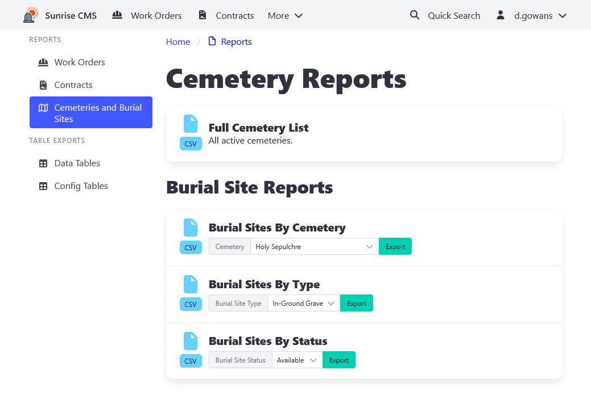

[Home](https://cityssm.github.io/sunrise-cms/)
•
[Help](https://cityssm.github.io/sunrise-cms/docs/)

# Reports

The Reports page offers many exports of Sunrise CMS data.
Most of the reports are offered as CSV files, a format compatible with tools
like Microsoft Excel.

Note that the "Table Exports" section includes raw exports of the Sunrise CMS tables.
These can be used for troubleshooting, or if no other report exists.
They are unformatted, and may include deleted records that have not been
purged from the database.
