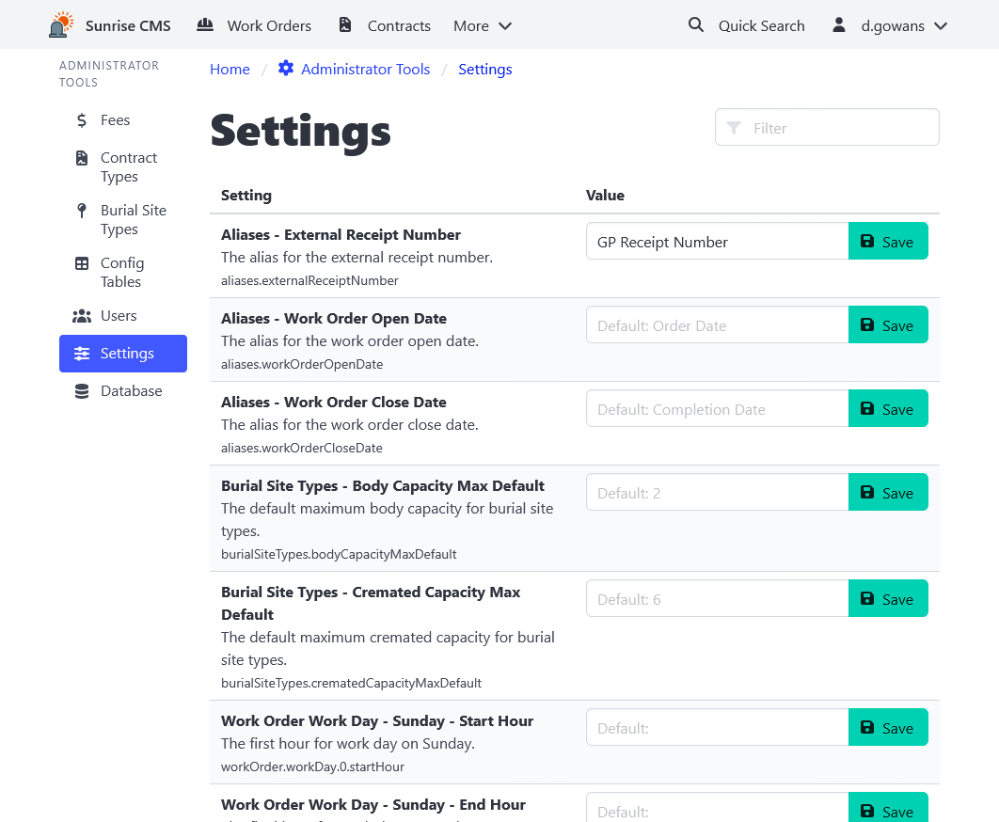

[Home](https://cityssm.github.io/sunrise-cms/)
•
[Help](https://cityssm.github.io/sunrise-cms/docs/)

# Settings

Some of the settings that are more commonly maintained by application power users
can be set in the Sunrise CMS interface. Settings updated here take effect immediately.

💡 Settings that change less frequently are found in the [`config.js` file](./configJs.md).
