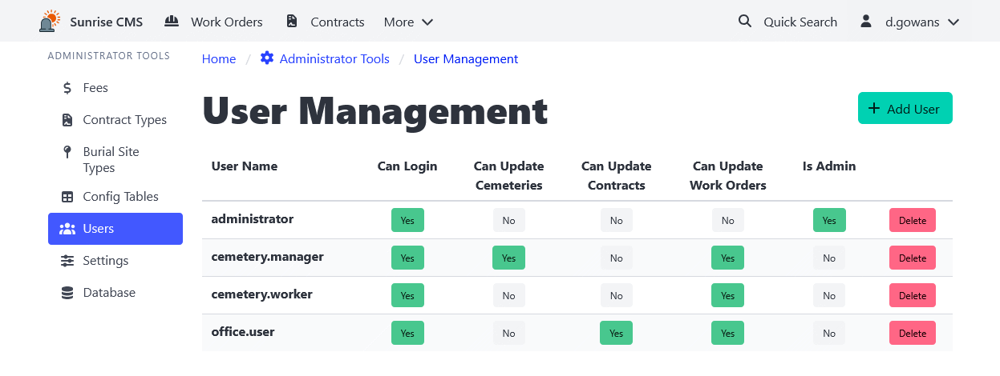

[Home](https://cityssm.github.io/sunrise-cms/)
•
[Help](https://cityssm.github.io/sunrise-cms/docs/)

# User Management

The User Management interface gives administrators the ability to assign permissions
within Sunrise CMS. Unlike
[assigning permissions in the `config.js` file](./configJs.md#user-configuration),
permission changes through this interface take effect immediately (after the user logs in).

**Note that passwords are not set or managed through this interface.**
User authentication is based on [settings in the `config.js` file](./configJs.md#login-configuration).

## Permissions

**Can Login** 
Required to allow a user to log in. Users who are able to log in have
read access to all types of records in the system.

**Can Update Cemeteries** 
Users have the ability to maintain cemetery and burial site records.

**Can Update Contracts** 
Users have the ability to maintain contracts and funeral home records.

**Can Update Work Orders** 
Users have the ability to maintain work orders.

**Administrator** 
Users have access to the administrator interfaces, with the ability to maintain
droplist options, fees, and other application settings.
