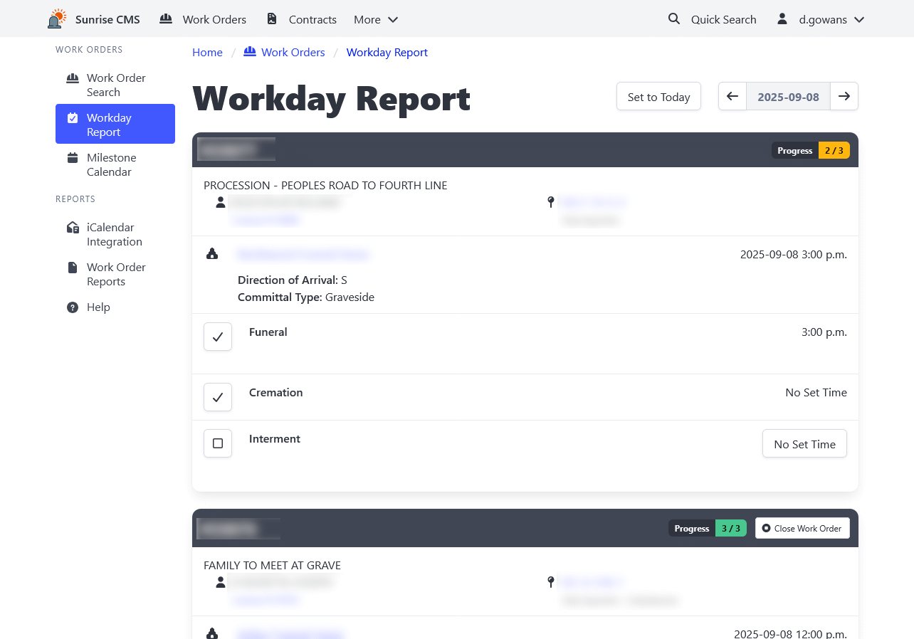

[Home](https://cityssm.github.io/sunrise-cms/)
•
[Help](https://cityssm.github.io/sunrise-cms/docs/)

# Work Orders

Work Orders can be used to direct cemetery activities such as
preparing and maintaining [burial sites](./burialSites.md),
and performing cremations and interments.

## Work Order Update

### Related Contracts

Work orders can be related to either [contracts](./contracts.md) or burial sites.

- If the work order is associated with performing work associated with a contract,
  like an interment, the work order should be linked to the associated contract.

- If the work order is not directly associated with a contract,
  like with ground maintenance, the work order could be associated with the burial sites
  in the area of where the work should occur.

### Milestones

Milestones form a task list on a work order.

A sample milestone list may be:

- **Ground Preparation** at 10am, single depth.
- **Arrival** from funeral at 2pm, direct to grave.
- **Interment** at 3:30pm.

Milestones can be marked off as completed on the work order itself,
or using the [Workday Report](#workday-report).

## Workday Report

The Workday Report shows all [milestones](#milestones) for a given day,
along with useful work order and contract details. Milestones can be marked off
as completed from the Workday Report, making it an effective tool for
grounds crews to see their workday in one view.

## Milestone Calendar

The Milestone Calendar displays all milestones for a given month in a calendar view.
It can be useful for identifying past milestones that may not have been marked off
as completed.

Each date can be clicked on to open the corresponding day's [Workday Report](#workday-report).

## Related

[Config Table Management](./configTableManagement.md) 
Update Work Order Types and Work Order Milestone Types.
